# Predict Student Performance from Game Play

Kaggle Competition

Link:[Predict Student Performance from Game Play | Kaggle](https://www.google.com/url?q=https://www.kaggle.com/competitions/predict-student-performance-from-game-play/overview&sa=D&source=editors&ust=1710507709249546&usg=AOvVaw3xgDEy0LTbAwUNIPouDOl4) 

* * *

Kontextus
---------

Egyre gyakoribb az oktatásban a gamifikáció, így téve vonzóbbá a tanulók számára a tanulást. Viszont egyelőre limitált a nyílt adathalmazok száma, így az adattudomány terén is friss téma.

Új és használható megközelítésekkel lehetővé válik a fejlesztők számára, hogy javítsák az oktató játékokat, így támogatva az oktatókat és az oktatást.

A versenyt a Learning Agency Lab szervezte és a fődíj 55.000$ volt. A verseny 2023 Június 29.-én fejeződött be és több mint kétezer versenyző mérte össze rajta a tudását. Célunk, hogy az eredményünk a top 500 szintjét elérje.

Cél
---

A cél a hallgatói teljesítmény prediktálása game logok alapján valós időben.

Kiértékelés
-----------

*   A kiértékelés az F1 score alapján történik
*   De a versenyben szerepet kapott a futásidő vizsgálata is, ahol  kiértékelésnél F1 score a legfontosabb, de a verseny egy saját metrikát alkalmaz amiben a futásidő is szerepet kap: 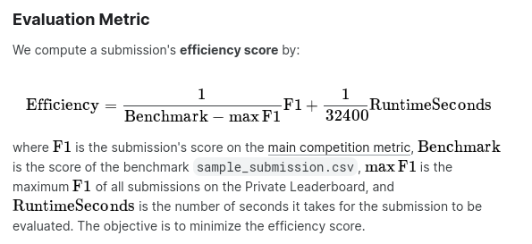
*   <session\_id>\_<question #> pároshoz kell prediktálni, hogy a user el fogja-e találni az adott kérdést (a sessionre vonatkozó korábbi információk alapján)

M1 Projektmunka megtervezése
----------------------------

A dokumentációt egy Google dokumentumban vezetjük: [https://docs.google.com/document/d/1KJAYvHrP2dIzGk8gpYcyu2qPAggk1nSptNz\_rXhTut8/edit?usp=sharing](https://www.google.com/url?q=https://docs.google.com/document/d/1KJAYvHrP2dIzGk8gpYcyu2qPAggk1nSptNz_rXhTut8/edit?usp%3Dsharing&sa=D&source=editors&ust=1710507709251442&usg=AOvVaw2S9JTZ1uJBp9NNsxtiiHuS) 

A projektnek létrehoztunk egy GitHub repot: [https://github.com/mestermarc/Student\_performance\_analysis](https://www.google.com/url?q=https://github.com/mestermarc/Student_performance_analysis&sa=D&source=editors&ust=1710507709251761&usg=AOvVaw1ktDgyxzYVb8c7MZ9iDYjs) 

A feladat megoldásához Pythont és Jupyter Notebook-ot választottunk. Az adathalmazt Pandas DataFrame struktúrába olvassuk be és dolgozzuk fel.

Feladatok

Leírás (TAD-ról)

M1 Projektterv

Az adatbányászati feladat kiválasztása és értelmezése, a projektmunka megtervezése, a majdani megoldások kiértékelésének rögzítése

M2 Adatelőkészítés

Adatelőkészítés (adatbázis és adatformátum kiválasztása, adattisztítás, stb.)

M3 Adatvizuaizáció

Adatvizualizáció és adatelemzés (korrelációanalízis, magyarázóváltozó\-választás, adattranszformációk, stb.)

M4 GT modellek bemutatása

Gépi tanulási modellek előállítása (modellválasztás, hibrid, mélytanulás, stb.)

M5 GT értékelés bemutatása

Gépi tanulási modellek értékelése (metrika-választás, bootstrapping, az eredmények javítása, hiperparaméter-hangolással, boosting alkalmazásával, stb.)

M6 Alkalmazás bemutatása

Az előállított adatbányászati folyamat gyakorlati alkalmazása (felhőbe történő telepítés, etikai kérdések, adatvédelem)

A feladatot a következő lépésekre bontottuk:

1.  Feladat értelmezése
2.  Kiértékelés definiálása
3.  Környezet kiválasztása és setup (+ Verziókezelés)
4.  Adatbeolvasás, Adatelőkészítés
5.  Feature Analysis (Adatvizualizáció)
6.  Feature Engineering (korrelációanalízis, magyarázóváltozó-választás, adattranszformációk, stb.)
7.  Modellek kipróbálása és kiválasztása
8.  Fine-tuning
9.  Modellek kiértékelése és vizualizációja
10.  Eredmény versenyeztetése (=M6??)

* * *

M2 Adatelőkészítés[\[a\]](#cmnt1)
---------------------------------

Az adathalmaz a Kaggle versenynél érhető el:

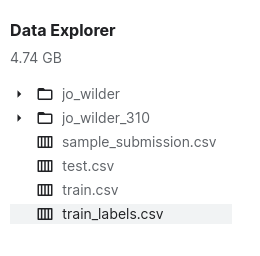

### Az adat formátuma

Az adat a játékban történő események log bejegyzéseiből épül fel. A játékban különböző események vannak (pl. Navigációs kattintás, Szereplőre kattintás). Egy jó dokumentáció az előforduló eseményekről itt található: [https://github.com/fielddaylab/jo\_wilder?tab=readme-ov-file#quiz](https://www.google.com/url?q=https://github.com/fielddaylab/jo_wilder?tab%3Dreadme-ov-file%23quiz&sa=D&source=editors&ust=1710507709257296&usg=AOvVaw17gc_Iph49-GMFxyI8pu5Q) 

Az adathalmazt Pandas DataFrame struktúrába olvassuk be és dolgozzuk fel.

*   Tulajdonságok értelmezése és végignézése.
*   Kategorikus és numerikus tulajdonságok szétválasztása.

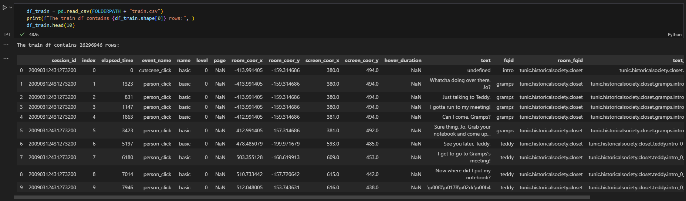

Adathalmaz beolvasás után

### Tulajdonságok leírása

*   session\_id - annak a munkamenetnek az azonosítója, amelyben az esemény történt.
*   index - az esemény indexe a munkamenethez.
*   elapsed\_time - mennyi idő telt el (milliszekundumban) a munkamenet kezdete és az esemény rögzítése között.
*   event\_name - az eseménytípus neve.
*   name \- az esemény neve (pl. azonosítja, hogy a notebook\_click a notebookot nyitja vagy zárja)
*   level \- a játék melyik szintjén történt az esemény (0-tól 22-ig)
*   page \- az esemény oldalszáma (csak a notebookkal kapcsolatos események esetében)
*   room\_coor\_x \- a kattintás koordinátái a játékbeli szobához viszonyítva (csak kattintási események esetén)
*   room\_coor\_y \- a kattintás koordinátái a játékbeli szobához viszonyítva (csak kattintási események esetén)
*   screen\_coor\_x \- a kattintás koordinátái a játékos képernyőjére vonatkoztatva (csak kattintási események esetén)
*   screen\_coor\_y \- a kattintás koordinátái a játékos képernyőjéhez viszonyítva (csak a kattintási események esetében).
*   hover\_duration - mennyi ideig (milliszekundumban) tartott a hover esemény (csak lebegési események esetén)
*   text - a szöveg, amelyet a játékos az esemény során lát.
*   fqid - az esemény teljes körű azonosítója.
*   room\_fqid - annak a helyiségnek a teljes körű azonosítója, ahol az esemény történt.
*   text\_fqid - az szöveg teljes körű azonosítója.
*   fullscreen - a játékos teljes képernyős módban van-e
*   hq - a játék kiváló minőségű módban van-e
*   music - a játék zenéje be van-e kapcsolva vagy sem
*   level\_group - a szintek melyik csoportjához - és kérdéscsoporthoz - tartozik ez a sor (0-4, 5-12, 13-22).

Célváltozók ID alapján:

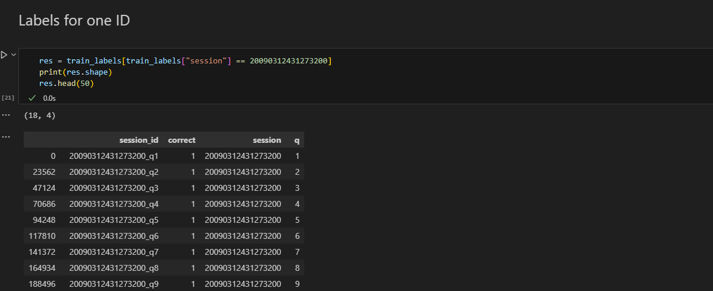

### Feature leírások, elérhetőségük vizsgálata

Kategorikus változók elérhetősége:

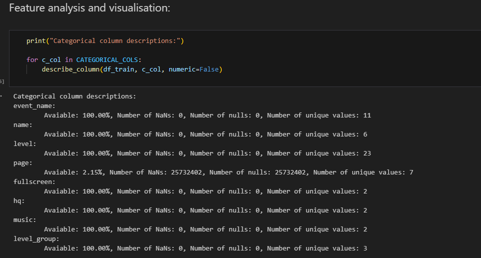

A page-n kívül minden log-hoz elérhetőek a kategorikus változók.

Kategorikus ID- változók elérhetősége:

Minden log-hoz tartozik egy szoba azonosító, a log-ok 36% százalékához  tartozik szöveg és 68 százalékához fqid (clicks on objects[\[b\]](#cmnt2)[\[c\]](#cmnt3)[\[d\]](#cmnt4)) .

Numerikus változók elérhetősége:

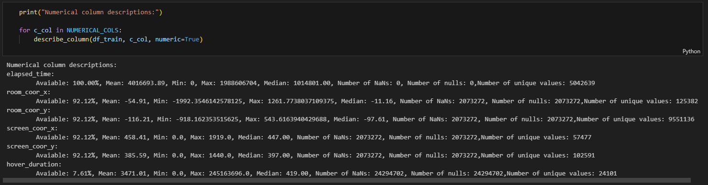

Minden log-hoz tartozik egy session kezdete óta eltelt idő, a 92 százalékához pedig kattintás esemény.

### Adatvizualizációk

Az adatok beolvasása után vizualizációk segítségével ábrázoltuk a különböző tulajdonságokat.

A session log-ok eloszlása a különböző szinteken

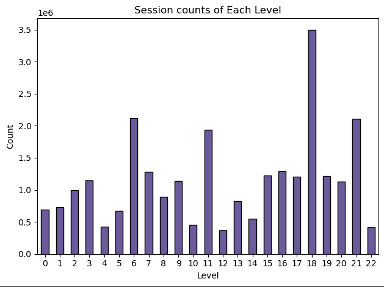

Kategorikus változók eloszlása hisztogramokon\[1\]:  
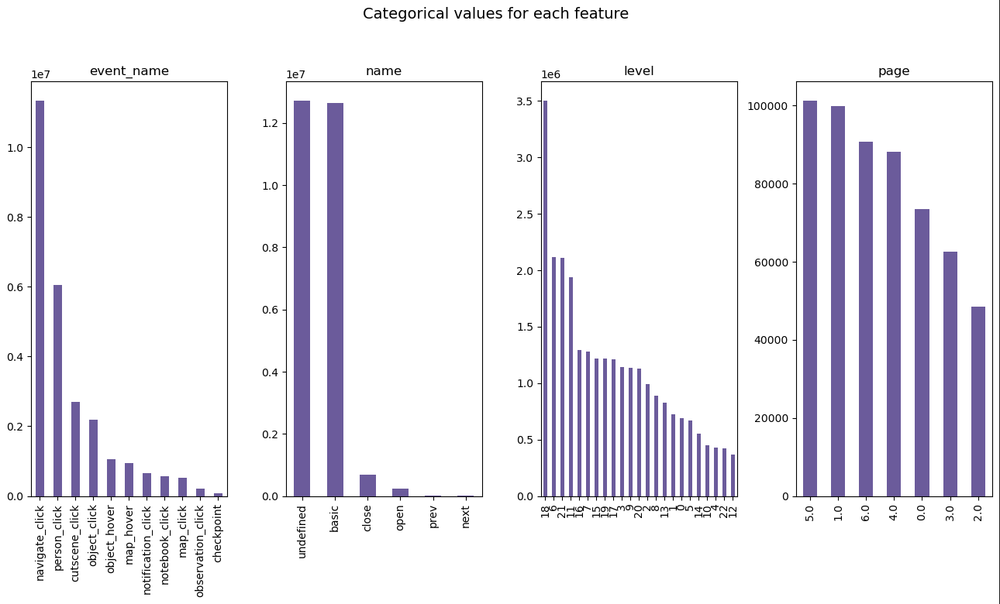

Kategorikus változók eloszlása hisztogramokon\[2\]:

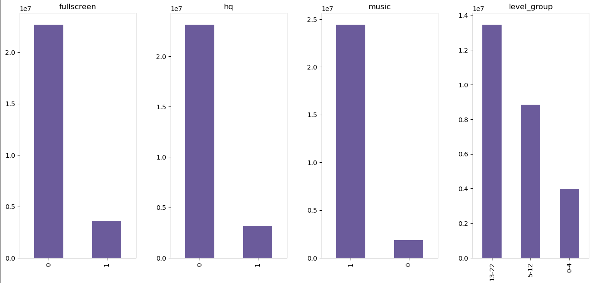

Szobákban történt log-ok arányának vizualizációja pie chart-on:

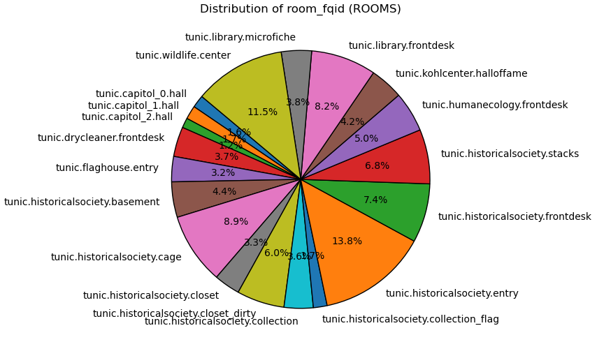

Karaktereken történt kattintások eloszlásának vizualizációja pie chart-on:

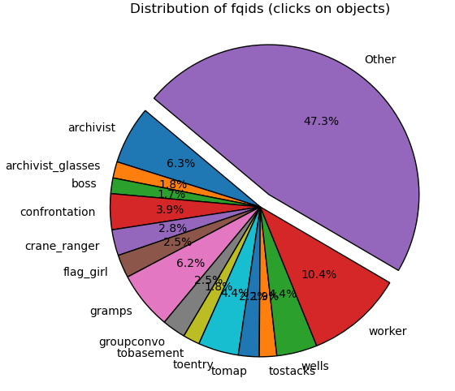

Egy sessionben eltöltött idő hisztogramon

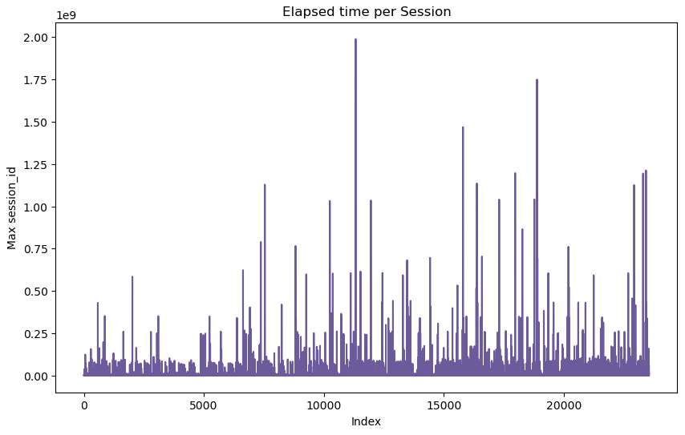

Kattintások eloszlása a képernyőn hisztogramon

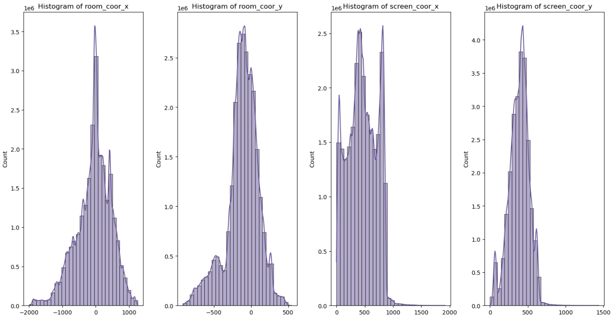

#### Kattintások vizualizációja típusok szerint

Számos esemény rendelkezik koordinátákkal is, amelyeket érdemes lehet megvizsgálni. A játékban 19 helyszín van, és minden egyes helyszínen belül több kattintás típus (pl. navigációs kattintás, objektum kattintás, szereplő kattintás). A diagramokon így érdemes a helyszínre és típusra is szűrni, hogy csak az egy kategóriába eső pontokat vizualizáljuk. A következőkben nézzük meg a játék első színhelyének a diagramjait:

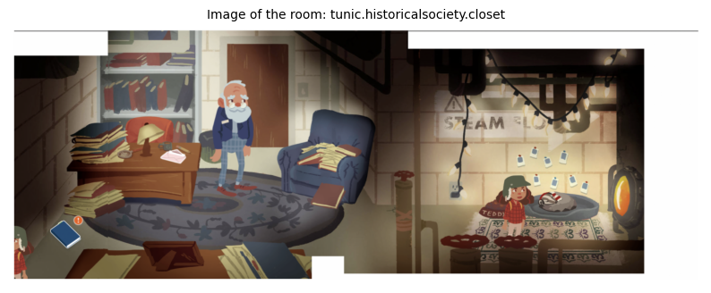

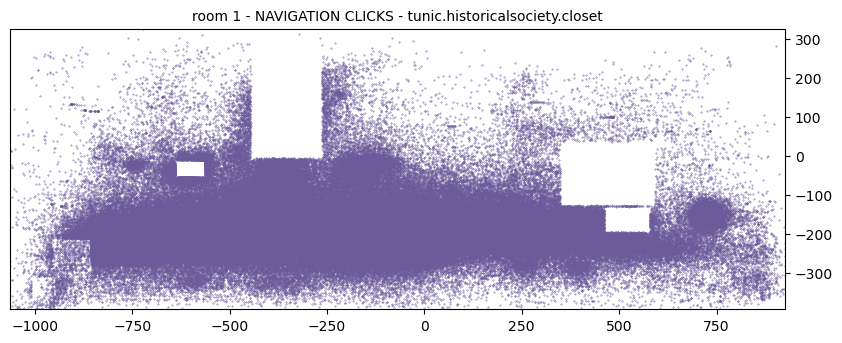

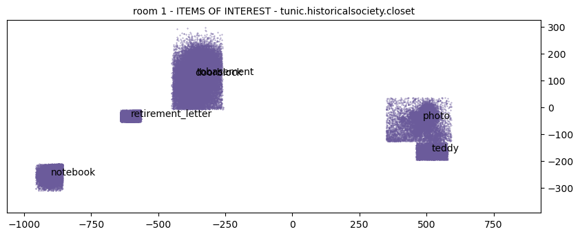

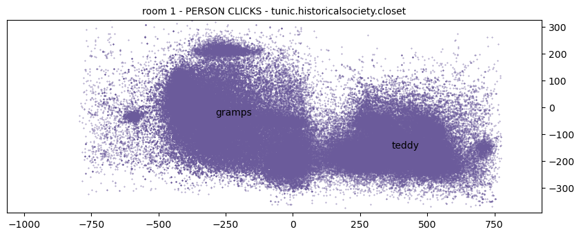

A diagramokon jól kirajzolódnak a helyszínen lévő objektumok, szereplők. Talán a koordináták is hordozhatnak magukban információt, de valószínűbb hogy a klikk események logjaiban az idő lesz érdekesebb és az hogy hányszor kellett a játékosnak megismételni az adott akciót (pl egy párbeszédet a játékban).

Session-ökhöz tartozó helyes válaszok kérdésenként:

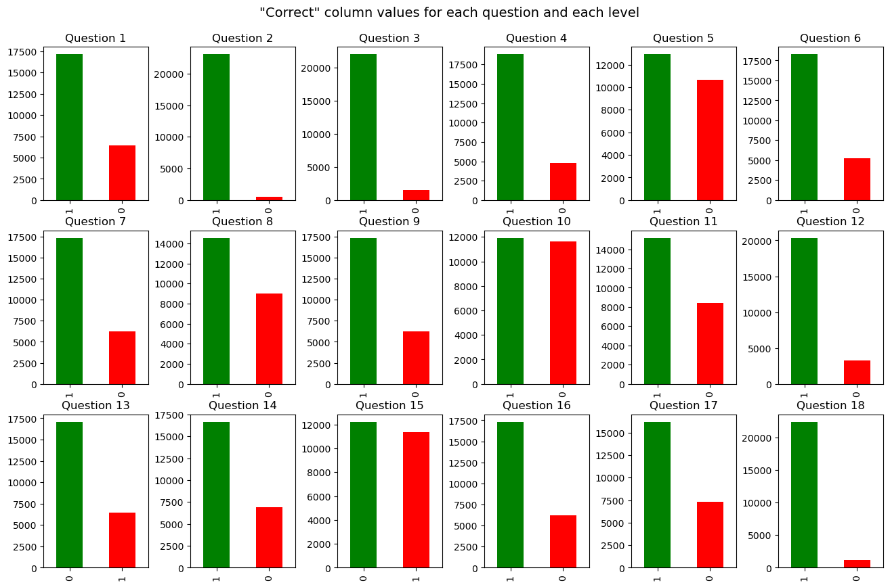

M3 Adatvizualizáció \[terv\]
============================

M4 GT modellek bemutatása
=========================